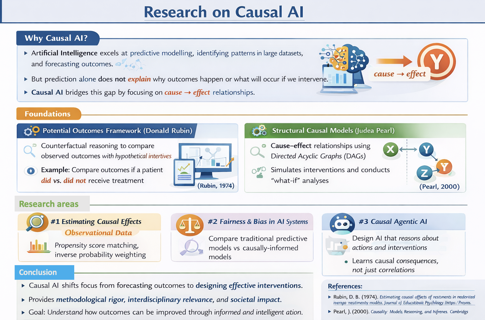

---
title: "Researchers"
---

# Prof. A. Bekker {#abekker}
Data is full of surprises, and I’m here to uncover them. I focus on modern statistical challenges and building tools that make a real impact. If you’re eager to learn by doing, tackle interesting problems, and have fun along the way, you’ll feel at home in our [D.A.T.A. research group](https://datagroup.netlify.app/).

# Dr. L. Chaka {#lchaka}
My research interests are Statistical Process control, Optimization, Design of experiments and Machine learning. My 
Google Scholar is [here](https://scholar.google.com/citations?user=eCogaLQAAAAJ&hl=en) and my ResearchGate profile is [here](https://www.researchgate.net/profile/Jean-Claude-Malela-Majika?ev=hdr_xprf).

# Mrs. L.E. Coetser {#lcoetser}
My research interests are in statistics in education. I have two projects available within this field for 2026.

# Dr. G. Crafford {#gcrafford}
My ResearchGate profile is available [here](https://www.researchgate.net/profile/Gretel-Crafford).

# Dr. R. Ehlers {#rehlers}
My profile is available [here](https://www.up.ac.za/statistics/staff-profiles/rene-ehlers).

# Prof. I.N. Fabris-Rotelli {#ifabris}
My research areas are Spatial Statistics, Image Processing and Remote Sensing with applications in Epidemiology and Criminology, and accessibility through Spatial Linear Network modelling. My Google Scholar is available [here](https://scholar.google.com/citations?user=MIP6ejEAAAAJ&hl=en). 
I am part of the [SpatialLab@UP](https://www.up.ac.za/statistics/spatiallabup) research group.

# Mr. A. Gqwaka {#agqwaka}
My research interests focus on efficiency and productivity analysis, particularly stochastic frontier analysis (SFA). I am interested in simulation-based econometric methods, especially Monte Carlo approaches, and their application to evaluating performance in sectors such as municipal service provision. 

# Ms. P.H.G. Jafta {#jafta}
I am a researcher with a focus on spatial modelling, regionalisation methods, and algorithmic fairness. My work examines how geographic structure, spatial aggregation, and clustering influence statistical inference and equity in decision-making systems. I am particularly interested in developing statistically rigorous approaches that integrate fairness considerations into spatial analysis and predictive modelling. My research combines theoretical development, simulation studies, and applied data analysis.

# Prof. F.H.J. Kanfer {#fkanfer}
My research interests have been shaped by analytical challenges encountered during industry
consultation projects. Practical questions arising from these engagements have informed the
formulation of statistical research problems and guided my academic inquiry. For example,
during a consultation project within the banking sector, I participated in the development of
credit scoring models aimed at assessing clients’ credit risk. Business stakeholders were
particularly interested in identifying the market segments underlying variations in risk
behaviour. This practical question inspired my research focus on integrating unsupervised
and supervised statistical learning approaches, specifically through the combination of
mixture distributions model with a mixture of regressions model. The projects I listed explore
some of these concepts and their applications.

# Dr. J. Kleyn {#jkleyn}
My research interest are in shrinkage and regularization methods for statistical models. Please see my webpage [here](https://www.up.ac.za/statistics/dr-judy-kleyn). 

# Mr. A.R. Kleynhans {#akleyn}
The core of my research is model based clustering. I am particularly interested in robust statistics, developing methods that remain reliable when data violate assumptions or contain outliers. I also work on variable and order selection in model-based clustering: identifying how many groups are present in the data and which variables are most informative for clustering.

# Dr. B. Mac'Oduol {#brenda}
My research lies at the intersection of distribution theory, survival analysis, and biostatistics,
with an aim of contributing to the theoretical development of parametric distributions,
including derivation of structural properties and inferential.
Building on this foundation, my current research extends distributional modelling into
survival and intermittent processes. More recently, my work incorporates machine learning
methods for survival data, with an emphasis on interpretability and the integration of classical
statistical theory with modern predictive modelling frameworks. The broader aim is to
develop principled, distribution-aware approaches to risk prediction in biostatistical
applications. My research profile and published works can be seen [here](https://scholar.google.com/citations?hl=en&view_op=list_works&gmla=AF9nlQt6b-347gf3nYhvPn5hIMLmVenTlbXE5_q4kX_Un0BtS2dBJu689VUuSQM0kHVbYJgmaozfGcvVXRS5E_AmO8Gk&user=vuEY7J4AAAAJ).

# Dr. K. Mahloromela {#kmah}	
My research area focuses on spatial and directional statistics, with applications in criminology, epidemiology, ecology, and human demography. Most of my work involves developing statistical methodology to address real-world problems in spatial modelling and prediction. My Google Scholar is available [here](https://scholar.google.com/citations?hl=en&user=YE_D6fEAAAAJ&view_op=list_works&gmla=APjjwubJf17T-fgRDrUuckJ_K6v-GHb0_gxIrvgZ5qcBDHlvgCHnq7_PUzhs8EW9Dg1TCYfISxrkZpHW19_lfRuQx_i7QgSb1nqt8g). 
I am part of the [SpatialLab@UP](https://www.up.ac.za/statistics/spatiallabup) research group.

# Dr. S.L. Makgai	{#seite}
My research interest is primarily in distribution theory and directional statistics, with applications to
compositional data, financial and insurance data, protein angle data and other biological systems. I
am interested in developing statistically models that can handle non-standard data—such as
angular, or structured datasets—and translating these into practical tools for bioinformatics, health
research, and quantitative finance (see my Google Scholar profile [here](https://scholar.google.com/citations?hl=en&user=b_dayF8AAAAJ&view_op=list_works&gmla=AF9nlQuUbcMWXBT7dT13j0lBqbg5OOWmkuqJ5b5LKEhy9ccob_SWtJ4ZGJGYkVEhds1jLuW9RQvhdAuQOo5HCx450TZzqT6FsJwiqw)). Students who work with me typically engage in projects that balance theory and application, with a strong emphasis on
methodological clarity, solid inference, and problems that have clear real-world relevance.

# Dr. M.J.C. Malela {#jc}
My research interests are Statistical Process control, Optimization, Design of experiments and Machine learning. My 
Google Scholar is [here](https://scholar.google.com/citations?user=eCogaLQAAAAJ&hl=en) and my ResearchGate profile is [here](https://www.researchgate.net/profile/Jean-Claude-Malela-Majika?ev=hdr_xprf).

# Prof. S. Manda {#smanda}
My profile is available [here](https://www.up.ac.za/statistics/prof-samuel-manda).

# Prof. S.M. Millard {#smillard}
My main research focus in the area of clustering. This includes model-based clustering ([MBC@UP](https://www.up.ac.za/statistics/mbcup-model-based-clustering-research-group))
and other forms of clustering. My research includes various developments in model-based clustering
including mixture modelling and mixture regression. Many real-world datasets contain
heterogeneous subpopulations that cannot be adequately described by a single statistical model. In
industry, such heterogeneity arises in customer segmentation, credit risk profiling, insurance
portfolio classification, and biological data analysis. Model-based clustering, particularly through
Gaussian mixture models and Gaussian mixture regression, provides a principled probabilistic
framework for identifying latent group structures while accounting for uncertainty in cluster
membership. In addition, I also have an interest in partition based clustering and hierarchical
clustering.

# Dr. N. Nakhaeirad {#najmeh}
My research focuses on three main areas: directional statistics, biostatistics, and machine learning. In relation to the proposed topics, my work in directional statistics specifically emphasises the development of new methodology for circular, cylindrical, and toroidal data. My research advances statistical theory and computation for complex periodic observations, such as wind direction, solar orientation, protein dihedral angles, and turning angles in animal movement, to support practical solutions in renewable energy, public health (computational biology and protein structure validation), and wildlife conservation and tourism. I lead two research groups at the University of Pretoria: [AdvDS@UP: Advances in Directional Statistics](https://www.up.ac.za/statistics/advdsup-advances-directional-statistics), and  [ML4HS@UP: Machine learning for health sciences](https://www.up.ac.za/statistics/ml4hsup-machine-learning-health-sciences). My Google Scholar profile is available [here](https://scholar.google.com/citations?user=vuI2p9UAAAAJ&hl=en).

# Dr. A.F. Otto {#aotto}
I work on statistics for the real world — the kind where data are messy, assumptions break, and neat textbook models just don’t cut it. My research spans robust statistics, clustering, distribution theory, and directional data, with a focus on building methods that stay reliable even when things go sideways.  I form part of the [D.A.T.A. research group](https://datagroup.netlify.app) and have 3 project ideas for 2026.

# Mr. J. Pillay {#jason}
It does not matter whether you end up in a corporate job, private research, or in academia, for incomplete data will always plague you. My focus turns a plague into your hidden  superpower (pun intended). Modelling data with missing values at the intersection of distribution theory, algorithmic design and clustering is the core of my research field. If you enjoy problem-solving, coding, and what goes on behind the polished algorithms that fill in the gaps, my projects, and my research group [D.A.T.A.](https://datagroup.netlify.app) might be the perfect fit for you.

# Dr. S.B. Skhosana	{#skhosana}
My research interests lie at the intersection of probabilistic modelling (mixture modelling), computational statistics and machine learning for regression analysis, model-based clustering and classification. I am mostly interested in developing flexible probabilistic models to address complex latent data problems arising in applied domains such as environmental economics, renewable energy, health and finance. My Google scholar profile is available [here](https://scholar.google.com/citations?user=tHMNOwwAAAAJ&hl=en). I am a principal member of the research groups [AdvDS@UP: Advances in Directional Statistics](https://www.up.ac.za/statistics/advdsup-advances-directional-statistics), [ML4HS@UP: Machine learning for health sciences](https://www.up.ac.za/statistics/ml4hsup-machine-learning-health-sciences) and [MBC@UP: Model based clustering](https://www.up.ac.za/statistics/mbcup-model-based-clustering-research-group). 

# Dr. A. Smit {#asmit}
My research areas focus on geostatistics with applications in environmental processes including geological and meteorological processes. This type of modelling can incorporate distribution theory, spatial and spatio-temporal statistics, and extreme value theory. My Google Scholar is available [here](https://scholar.google.com/citations?user=w7L1qXwAAAAJ&hl=en&oi=ao). 
I am part of the [SpatialLab@UP](https://www.up.ac.za/statistics/spatiallabup) research group. 

# Dr. R. Stander {#rstander}
My research interests include Spatial Statistics, Spatial Hotspot Detection and Spatial Similarity, with applications in epidemiology and criminology. My Google Scholar is available [here](https://scholar.google.com/citations?user=at42EikAAAAJ&hl=en). 
I am part of the [SpatialLab@UP](https://www.up.ac.za/statistics/spatiallabup) research group.

# Dr. R.N. Thiede {#rthiede}
My research interests include Spatial Statistics, Spatial Networks, and Accessibility Analyses, with applications in analysing road networks and urban systems. My research focuses on developing statistical methodology to solve real-world problems, in line with UN SDGs 9 and 11. My Google Scholar is available [here](https://scholar.google.com/citations?user=y-BV2iUAAAAJ&hl=en). 
I am part of the [SpatialLab@UP](https://www.up.ac.za/statistics/spatiallabup) research group.

# Dr. A. van der Merwe {#ane}
My research lies in the development and application of statistical models for dependent data. My most recent primary interests include skewed error distributions, integer-valued time series, overdispersed count processes, and thinning-based models. My publications can be viewed [here](https://orcid.org/0000-0002-1183-3740).

# Prof. J. van Niekerk {#jvanniekerk}
My research areas are Bayesian methods, Biostatistics, Spatial Statistics and Computational Statistics. Most of my work has been at the intersection between statistical methods and the computing of those methods. I am a developer of three R packages; [INLA](https://www.r-inla.org/), [INLAjoint](https://github.com/DenisRustand/INLAjoint) and graphpcor.
My Google Scholar is available [here](https://scholar.google.com/citations?user=LVqMNKQAAAAJ&hl=en&oi=ao).
I have projects available but also get excited by your project ideas - so feel free to bring your own!

# Dr. P.J. van Staden {#pvanstaden}
Currently the research area I focus on is Statistics in Sport and Sports Analytics. See [this document](https://drive.google.com/file/d/1RtVc5aaLrbDFIJLRsoldxddQxosIblv6/view?usp=sharing) for full details. I have four Honours research projects available. Note that, where possible, I will gladly adjust the scope of any of these projects based on my Honours students' ideas and interests. You are also welcome to have a look at my research profile on Google Scholar, [here](https://scholar.google.com/citations?user=9sQzsycAAAAJ&hl=en&oi=sra).

# Dr. A. Whata
I work on causal AI. My Google Scholar is available [here](https://scholar.google.com/citations?hl=en&user=IWz4_D0AAAAJ).

{width=600}
